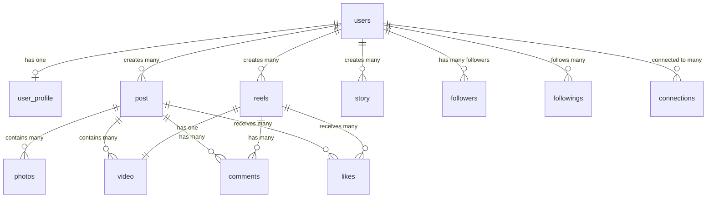

# Instagram-Like Database Schema

This repository contains database schemas for both **MySQL** and **PostgreSQL** with an Instagram-like structure.

## 📋 Overview

The schema includes all core Instagram features:
- User authentication and profiles
- Posts with photos and videos
- Reels (short-form video content)
- Stories (24-hour temporary content)
- Social relationships (followers, followings, connections)
- Engagement features (likes, comments, hashtags)

## 🗂️ Database Structure

### Core Tables

| Table | Description |
|-------|-------------|
| `users` | User authentication and account information |
| `user_profile` | Extended user profile data (bio, profile picture, etc.) |
| `post` | Regular Instagram posts |
| `photos` | Photo content metadata and URLs |
| `video` | Video content metadata and URLs |
| `reels` | Short-form video content (Instagram Reels) |
| `story` | Temporary 24-hour stories |
| `followers` | Follower relationships (who follows whom) |
| `followings` | Following relationships (whom a user follows) |
| `connections` | Mutual connections/friendships |

### Supporting Tables

| Table | Description |
|-------|-------------|
| `comments` | Comments on posts and reels (supports nested replies) |
| `likes` | Likes on posts, reels, and comments |
| `hashtags` | Hashtag definitions and usage counts |
| `post_hashtags` | Many-to-many relationship between posts and hashtags |

## 🔗 Key Relationships



## 🚀 Setup Instructions

### MySQL Setup

1. **Install MySQL** (if not already installed):
   ```bash
   # macOS
   brew install mysql
   brew services start mysql
   
   # Ubuntu/Debian
   sudo apt-get install mysql-server
   sudo systemctl start mysql
   ```

2. **Create the database**:
   ```bash
   mysql -u root -p < mysql_schema.sql
   ```

3. **Verify installation**:
   ```bash
   mysql -u root -p
   USE instagram_db;
   SHOW TABLES;
   ```

### PostgreSQL Setup

1. **Install PostgreSQL** (if not already installed):
   ```bash
   # macOS
   brew install postgresql
   brew services start postgresql
   
   # Ubuntu/Debian
   sudo apt-get install postgresql
   sudo systemctl start postgresql
   ```

2. **Create the database**:
   ```bash
   psql -U postgres -f postgres_schema.sql
   ```

3. **Verify installation**:
   ```bash
   psql -U postgres -d instagram_db
   \dt
   ```

## 📊 Schema Details

### Users & Profiles

**users** table stores authentication data:
- `user_id` - Primary key
- `username` - Unique username
- `email` - Unique email address
- `password_hash` - Hashed password
- `is_verified` - Email/phone verification status
- `is_active` - Account active status

**user_profile** table stores profile information:
- `profile_id` - Primary key
- `user_id` - Foreign key to users (1:1 relationship)
- `full_name`, `bio`, `profile_picture_url`
- `is_private` - Private account flag
- `is_business_account` - Business account flag

### Content Tables

**post** - Regular posts with metadata:
- Supports multiple photos/videos per post
- Tracks likes, comments, shares counts
- Can be archived or have comments disabled

**reels** - Short-form video content:
- Links to video table for media
- Includes audio information
- Tracks views, likes, comments, shares

**story** - Temporary 24-hour content:
- Supports both photos and videos
- Auto-expires after 24 hours (`expires_at` field)
- Tracks view counts

### Social Relationships

**followers** - Tracks who follows whom:
- `user_id` - The user being followed
- `follower_user_id` - The user who is following

**followings** - Tracks whom a user follows:
- `user_id` - The user who is following
- `following_user_id` - The user being followed

**connections** - Mutual relationships:
- Stores connections between two users
- Ensures `user_id_1 < user_id_2` for consistency
- Supports status: pending, accepted, blocked

## 🔍 Sample Queries

### Get user's followers count
```sql
SELECT COUNT(*) as follower_count
FROM followers
WHERE user_id = 1;
```

### Get user's posts with photo count
```sql
SELECT p.post_id, p.caption, COUNT(ph.photo_id) as photo_count
FROM post p
LEFT JOIN photos ph ON p.post_id = ph.post_id
WHERE p.user_id = 1
GROUP BY p.post_id;
```

### Get trending hashtags
```sql
SELECT hashtag_name, usage_count
FROM hashtags
ORDER BY usage_count DESC
LIMIT 10;
```

### Get user's feed (posts from followed users)
```sql
SELECT p.*, u.username
FROM post p
JOIN users u ON p.user_id = u.user_id
WHERE p.user_id IN (
    SELECT following_user_id
    FROM followings
    WHERE user_id = 1
)
ORDER BY p.created_at DESC
LIMIT 20;
```

### Get active stories (not expired)
```sql
SELECT s.*, u.username
FROM story s
JOIN users u ON s.user_id = u.user_id
WHERE s.expires_at > NOW()
ORDER BY s.created_at DESC;
```

## 🎯 Key Features

### Database-Specific Optimizations

**MySQL:**
- Uses `InnoDB` engine for ACID compliance
- `AUTO_INCREMENT` for primary keys
- `ENUM` types for constrained values
- Automatic `updated_at` timestamp updates
- UTF8MB4 charset for emoji support

**PostgreSQL:**
- Uses `BIGSERIAL` for auto-incrementing IDs
- `TIMESTAMP WITH TIME ZONE` for proper timezone handling
- Triggers for automatic `updated_at` updates
- CHECK constraints for data validation
- More flexible text handling

### Indexes

Both schemas include strategic indexes on:
- Foreign keys for join performance
- Username and email for login queries
- Created_at timestamps for chronological queries
- User IDs for filtering user-specific content

### Constraints

- **Foreign Keys**: Ensure referential integrity with CASCADE deletes
- **Unique Constraints**: Prevent duplicate followers/followings
- **Check Constraints**: Validate enum-like values and data consistency
- **NOT NULL**: Enforce required fields

## 📝 Notes

- All timestamps use the database's current time
- Passwords should be hashed before storage (use bcrypt, argon2, etc.)
- The `connections` table ensures consistent ordering (`user_id_1 < user_id_2`)
- Stories automatically expire after 24 hours (application should clean up)
- Counters (likes_count, comments_count) should be updated via triggers or application logic

## 🔐 Security Considerations

1. **Never store plain-text passwords** - Always hash with bcrypt/argon2
2. **Use parameterized queries** - Prevent SQL injection
3. **Implement rate limiting** - Prevent abuse
4. **Validate user input** - Sanitize all user-provided data
5. **Use HTTPS** - Encrypt data in transit
6. **Regular backups** - Protect against data loss

## 📈 Scalability Considerations

For production deployments:
- Add **partitioning** for large tables (posts, photos, videos)
- Implement **caching** (Redis) for frequently accessed data
- Use **CDN** for media files (photos, videos)
- Consider **read replicas** for high read loads
- Implement **sharding** for horizontal scaling
- Add **full-text search** (Elasticsearch) for hashtags and captions

## 📄 License

This schema is provided as-is for educational and development purposes.
